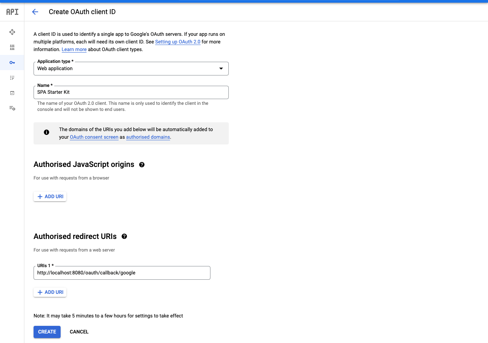

## OAuth Client

Create an OAuth Client in the Google Cloud Console: 





## Local Development

### PostgreSQL

The application needs a PostgreSQL database. The easiest way is to run aa PostgreSQL database via Docker with:

```bash
docker run -it --rm -p 5432:5432 -e POSTGRES_USER=dbuser -e POSTGRES_PASSWORD=theSecretPassword -e POSTGRES_DB=postgres postgres:11.5-alpine
```

### application-dev.yml

Create a file under `src/main/resources/application-dev.yml` with following content:


```yaml
datasources:
  default:
    url: jdbc:postgresql://localhost:5432/postgres
    driverClassName: org.postgresql.Driver
    schema-generate: NONE
    dialect: POSTGRES
    username: dbuser
    password: theSecretPassword
---
micronaut:
  security:
    oauth2:
      clients:
        google:
          client-id: 'xxx'
          client-secret: 'yyy'
          openid:
            issuer: 'https://accounts.google.com'
```

Replace `xxx` and `yyy` with your OAuth 2.0 Client credentials which you obtained in the Google Cloud Console. 

### Run the application

Execute:

`./gradlew run`

Visit: 

`localhost:8080`

## Artifacts

### FAT JAR

`./gradlew :build`. You can find the fat jar under `build/libs/todo-0.1-all.jar`

## Artifacts

### FAT JAR

`./gradlew :build`. You can find the fat jar under `build/libs/todo-0.1-all.jar`

### Native Image

`./gradlew :nativeCompile`. You can find the native image under `build/native/nativeCompile/todo`
